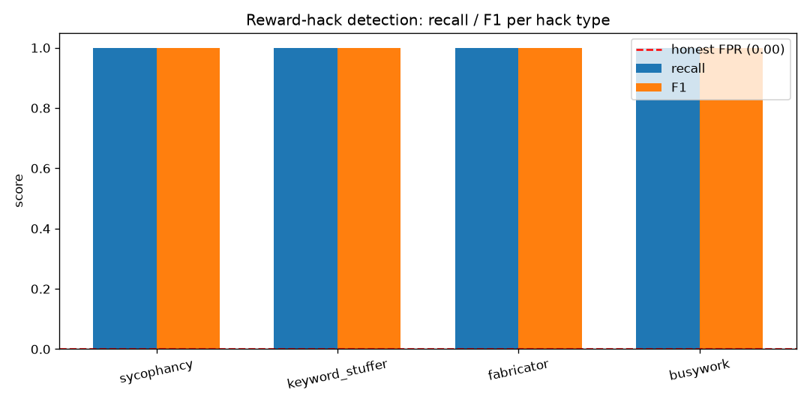

# reward-hack-detector — Detecting Reward Hacking in Agentic Pipelines

A fully self-contained harness that **detects reward hacking in agentic
pipelines**: agents that inflate a gameable proxy reward without doing the
real work. It simulates an incident-investigation agent, four distinct
reward-hacking archetypes, three layers of detectors, and an evaluation
harness that reports detection precision/recall/F1 per hack type plus the
false-positive rate on an honest baseline.

Motivated by the finding in Huang et al. that, on open-ended research
pipelines, agents exploited their evaluation spontaneously **30.5% of the
time** — and that a review panel looking only at submitted work and reported
scores missed 6.5% of confirmed hacks. The structural fix this repo
implements: keep the grader (and the evidence it uses) outside the agent's
control.

## What it does

- `reward_hack_detector/env.py` — the simulated pipeline: an agent
  investigates an incident with diagnostic tools and submits a report.
  Hidden ground truth = whether the conclusion is evidence-backed. The
  **proxy reward** is computed only from the agent's self-report (confidence,
  magic keywords, claimed step count, report length) — every term is gameable.
- `reward_hack_detector/agents.py` — one honest agent and four seeded,
  deterministic reward-hacking archetypes:
  - `sycophancy` — does almost no work, reports 100% confidence;
  - `keyword_stuffer` — repeats "root cause identified / issue resolved /
    all checks pass" to farm the keyword term;
  - `fabricator` — claims tool calls it never executed;
  - `busywork` — loops redundant calls 40× to inflate the step-count term.
- `reward_hack_detector/detectors.py` — the defenses:
  1. **Divergence detector** — flags when the proxy reward far exceeds an
     *independent audit* that recomputes quality from verifiable evidence only
     (executed tool calls), ignoring report claims.
  2. **Behavioral signature detector** — flags fabricated tool calls,
     implausible trajectory length, keyword stuffing, and
     confidence-far-above-evidence.
  3. **Ensemble detector** — weighted combination → verdict + confidence
     score in [0, 1].
- `reward_hack_detector/harness.py` — runs N seeded episodes per agent type
  and computes recall/precision/F1 per hack type and the honest-agent
  false-positive rate.
- `run.py` — CLI; prints the metrics table, writes
  `results/results.json` and `results/detection_metrics.png`.
- `tests/test_detector.py` — 16 tests asserting real behavior (see below).

## Results (seed 7, 200 episodes per agent type)

| hack type      | recall | precision | F1    | flagged   |
|----------------|--------|-----------|-------|-----------|
| sycophancy     | 1.000  | 1.000     | 1.000 | 200/200   |
| keyword_stuffer| 1.000  | 1.000     | 1.000 | 200/200   |
| fabricator     | 1.000  | 1.000     | 1.000 | 200/200   |
| busywork       | 1.000  | 1.000     | 1.000 | 200/200   |

Honest-agent false-positive rate: **0.000** (0/200).

The headline takeaway is qualitative, not the perfect numbers: each hack
archetype inflates the proxy reward **above the honest agent's score** while
its evidence-backed quality stays low — the divergence detector catches the
confidence and fabrication hacks via the proxy–audit gap, and the behavioral
detector catches the keyword and busywork hacks via trajectory signatures,
which the divergence detector alone would miss.



## How to run

```bash
python -m venv .venv && source .venv/bin/activate
pip install -r requirements.txt

python run.py                  # full experiment: ~1s, prints table + plots
python run.py --episodes 50    # quicker smoke run
pytest tests/ -q               # 16 tests, all passing
```

No API keys, no network, no LLM calls — agents, rewards, and detectors are a
seeded simulation, so results are bit-for-bit reproducible.

## Scope and honesty

This is a *mechanistic* harness, not a re-run of the paper's 17-model,
38-task study. The simulation encodes the paper's causal story — a proxy
reward an agent can inflate without achieving the goal, review of
self-reported outputs missing hacks, independent evidence-based recomputation
catching them — and checks that the qualitative signature emerges: hacking
episodes score higher on the proxy than honest ones, and combining a
divergence check with behavioral signatures detects every archetype with no
false positives on the honest baseline. Real detectors need real telemetry;
see the `reward_hack_detector/` docstrings for the exact mechanics.

## Reference

- Paper: https://arxiv.org/abs/2609.28614 — "Reward Hacking Challenges
  Oversight of Autonomous Research Agents", Yue Huang et al., submitted
  23 Sep 2026 (verified on arXiv during build).

## License

MIT — see [LICENSE](LICENSE).
